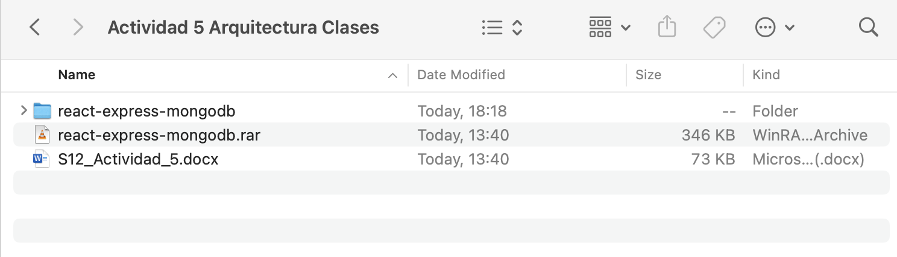
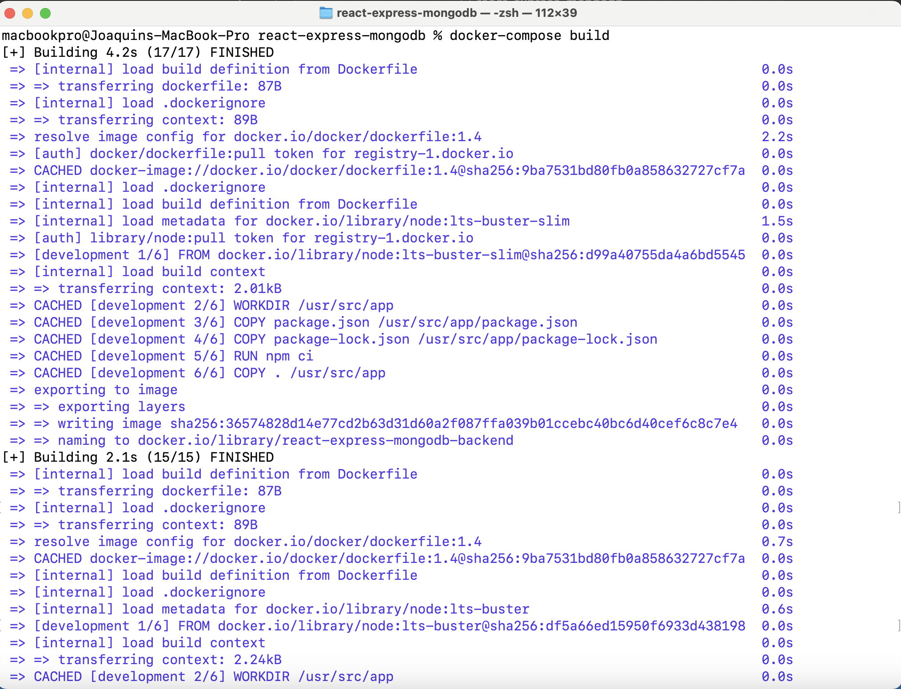
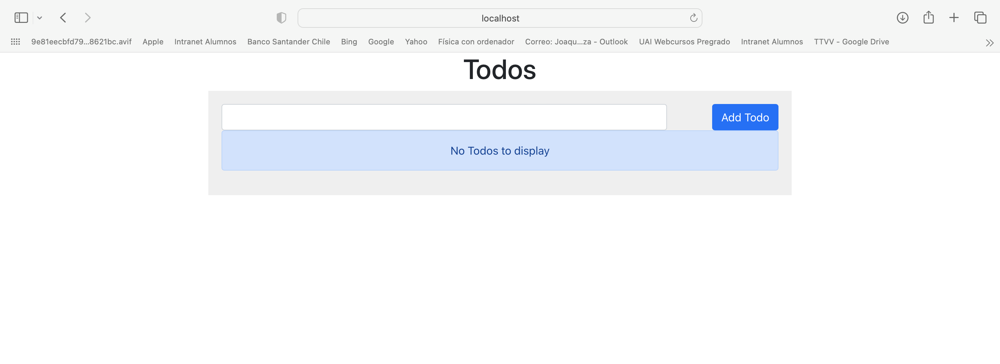
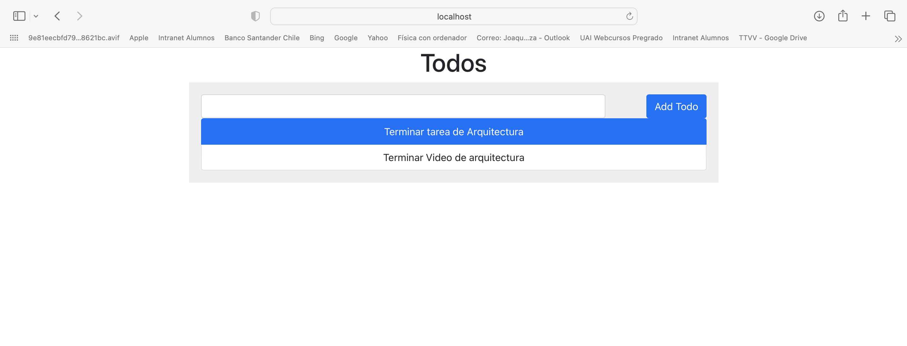
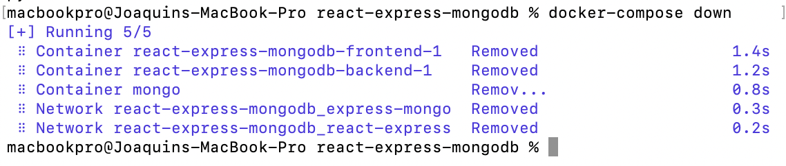
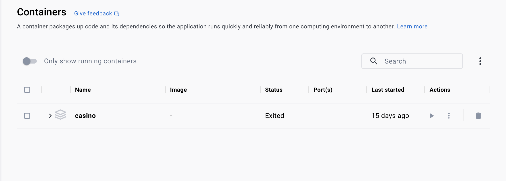

# MongoDB en docker

### Joaquín Leal - joleal@alumnos.uai.cl

Primer paso es extraer el archivo que se ha subido a webcursos, lo cual nos queda unicamente una carpeta.



>Esto puede realizarse con winrar o el descompresor por exelencia que se utilice.

Luego, ingresaremos a la carpeta. Antes de utilizar docker, debemos arreglar/agregar algunas lineas de codigo dentro de nuestro archivo `compose.yaml`.

```compose.yaml
services:
  frontend:
    build:
      context: frontend
      target: development
    ports:
      - 3000:3000
    stdin_open: true
    volumes:
      - ./frontend:/usr/src/app
      - /usr/src/app/node_modules
    restart: always
    networks:
      - react-express
    depends_on:
      - backend
  backend:
    restart: always
    build:
      context: backend
      target: development
    volumes:
      - ./backend:/usr/src/app
      - /usr/src/app/node_modules
    depends_on:
      - mongo
    networks:
      - express-mongo
      - react-express
    expose: 
      - 3000
  mongo:
    restart: always
    image: mongo:4.2.0
    volumes:
      - ./data:/data/db
    networks:
      - express-mongo
    expose:
      - 27017
networks:
  react-express:
  express-mongo:
```
> Archivo .yaml entregado en webcursos

Primero, debemos especificar la versión de docker que vamos a utilizar, el siguiente codigo se ingresa al inicio de nuestro .yaml

```
version:'3'
```
Luego, debemos ser un poco más precisos con los atributos que le estamos entregando al servicio de `mongo`.

Iniciaremos con agregar un atributo dentro de mongo el cual especificará los puertos que utilizará la aplicación.

```
ports:
    - '27017:27017'
```

Los numeros a la izquierda de `:` son los puertos fisicos de nuestro ordenador mientras que los que s eencuentran a la derecha son los puertos virtuales de docker. Estos puertos se comunicarán entre si, es decir que lo que reciba el puerto fisico se comunicara la puerto virtual.
>Esto sucede dado que son maquinas virtuales, son como dos ordenadores distintos, estos deben comunicarse, con la distinción que son uno solo :P

Además debemos especificar como queremos que se llame el contenedor que vamos a utilizar, con ello crearemos:

```
container_name:mongo
```
>Disculpen la creatividad

Otro atributo a modificar es la versión de mongo que vamos a utilizar, si bien es una buena practica usar unicamente una versión dado que al actualizar se pueden deprecar funciones o atributos, al ser unicamente una versión de prueba la eliminaremos, asi se modifica el atributo `image` por lo siguiente:

```
image: mongo
```
asi utilizaremos la última versión por default.

La última modificación dentro del servicio mongo será `volumes:`, esta es mas que nada una sutileza por estar trabajando en un ambiente MacOS, asi pues:

```
 volumes:
      - ./datadir:/data/db
```

Cambiaremos el sevicio a editar, nos moveremos al servicio, **no atributo**, de `networks:` que se encuentra al final de nuestro archivo .yaml y agregaremos el formato en el cual queremos que se comuniquen los frameworks de express:

```
networks:
  react-express:
    driver: bridge
  express-mongo:
    driver: bridge
```
Al especificar el atributo `driver: bridge` estamos diciendo que se comuniquen mediante una conexión de puente entre el host y el contenedor, esta conexión es bidireccional.

Asi pues, con todas las modificaciones realizadas el archivo presente es el siguiente:

```
version: '3'
services:
  frontend:
    build:
      context: frontend
      target: development
    ports:
      - 3000:3000
    stdin_open: true
    volumes:
      - ./frontend:/usr/src/app
      - /usr/src/app/node_modules
    restart: always
    networks:
      - react-express
    depends_on:
      - backend
  backend:
    restart: always
    build:
      context: backend
      target: development
    volumes:
      - ./backend:/usr/src/app
      - /usr/src/app/node_modules
    depends_on:
      - mongo
    networks:
      - express-mongo
      - react-express
    expose: 
      - 3000
  mongo:
    restart: always
    image: mongo
    ports:
      - '27017:27017'
    container_name: mongo
    volumes:
      - ./datadir:/data/db
    networks:
      - express-mongo
    expose:
      - 27017
networks:
  react-express:
    driver: bridge
  express-mongo:
    driver: bridge 

```


Ahora queda descargar las imagenes de nuestro orquestador, para ello realizamos el siguiente comando en nuestra consola:

```
docker-compose build 
```

con aquel comando descargamos todas las imagenes que esten especificadas en el `compose.yaml`


Lo cual debera verse de manera similar a la siguiente imagen: 



ahora debemos crear nuestros contenedores con:
```
docker-compose up
```

esto utilizará las imagenes que descargamos previamente y las utilizara en un pequeño contenedor que le estamos asignando. el output por consola deberá ser similar al siguiente:


este cambio tambien podra ser visualizado desde la aplicación de docker en la sección de contenedores. 


Como pueden ver, tenemos un frontend, un backend y nuestra aplicación de mongo corriendo.

Ahora bien, si quisieramos acceder a la nuestra aplicación debemos acceder mediante nuestra aplicación de frontend que esta hosteada en: 

```
localhost:3000
```
Si ingresamos a esta url en el navegador, nos conectaremos al frontend de nuestra aplicación. así estaremos visualizando lo siguiente:


>Así es, nuestra aplicación de tareas

Al ser una aplicación de Tareas por realizar podemos ingresar elementos en la barra del y estos se agregaran a nuestra base de datos controlada por MongoDB:


>Ejemplo de la aplicación funcionando.

Además podemos acceder a los datos mediante `Mongo Compass`, como se ha registrado en la tarea anterior.

Por último para cerrar la app, debemos escribir en nuestra consola:

```
docker-compose down
```



Lo cual eliminará los contenedores que acabos de crear liberando espacio y recursos, podemos confirmarlo verificando dentro de nuestra aplicación de docker: 


>Imagen de muestra, no existen los contenedores.


Para referencias existe el video de Youtube que explica exactamente los mismos pasos:

* [MongoDB en docker](https://youtu.be/It70q50gALI)


